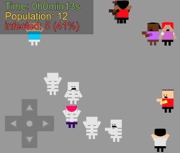

# Zombie Infestation
> A Spread Disease Simulator and a Zombie Infestation Mini Game made with HTML5 Canvas, JavaScript and SVG.

## PWA
It's a Progressive Web App (PWA) that you can use offline :)

A **HTML5 Canvas** Game and Simulator with random humans drawn in SVG. Every humans/zombies has aleatory moves (up, right,left,down) and every one has one random audio talk.

## Online Test
[https://treedbox.github.io/zombie-infestation/](https://treedbox.github.io/zombie-infestation/)

## Extremely lightweight
#### SVG
All the images are actually SVG, leaving this game lightly light.
#### OGG
All audios are in the OGG format (Ogg Vorbis).

## Game Dynamics
1. When you touch the screen, you add a human;
2. Every human who was touched by a **zombie**, turns a zombie too;
3. Every zombie walk more slow than a human;
4. Every zombie who touch a human says something;
5. Every human say a random phrase in a random volume;
6. When the last human is touched, the game stop;
7. If you use some keyborad arrow, W,A,D,S, or touch/click the joystic, a **blonde boy** will appear as your player;
8. When your player is contamined, you lose control of it;
9. The time stop when everyone is a zombie.

## Audio files
Audio provided by some of my friends and Robson's friends, through whatsapp.

#### Audio Credits:
- Antônio Rodrigues Neto
- [José Robson Mariano Alves](https://github.com/badernageral)
- Luiz Carlos Costa Ferreira
- Marksonvânio Amaral Marques
- Paulo Roberto ibes da cruz

## Import
#### Using `Treedbox Random Color`:

https://github.com/treedbox/treedbox-random-color

## Tested
**Google Chrome 55** and **60**

**Firefox 50.1.0** and **55.0.2**

\* Works without a server

## Meta
Front-End Developer: [Jonimar Marques Policarpo](http://linkedin.com/treedbox 'LinkEdin')

Twitter: [@treedbox](http://twitter.com/treedbox)

E-mail: [treedbox@gmail.com](mailto:treedbox@gmail.com)

Site: [treedbox](http://treedbox.com)

## License
[MIT](LICENSE.md) © [TreedBox](https://github.com/treedbox)

### Offical Repository
[https://github.com/treedbox/zombie-infestation/](https://github.com/treedbox/zombie-infestation/)
